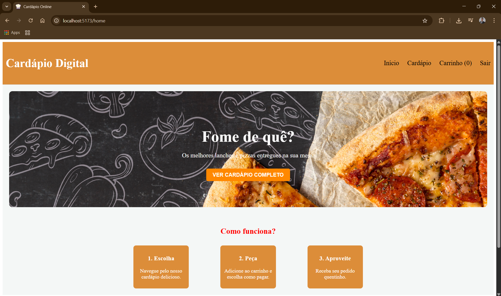
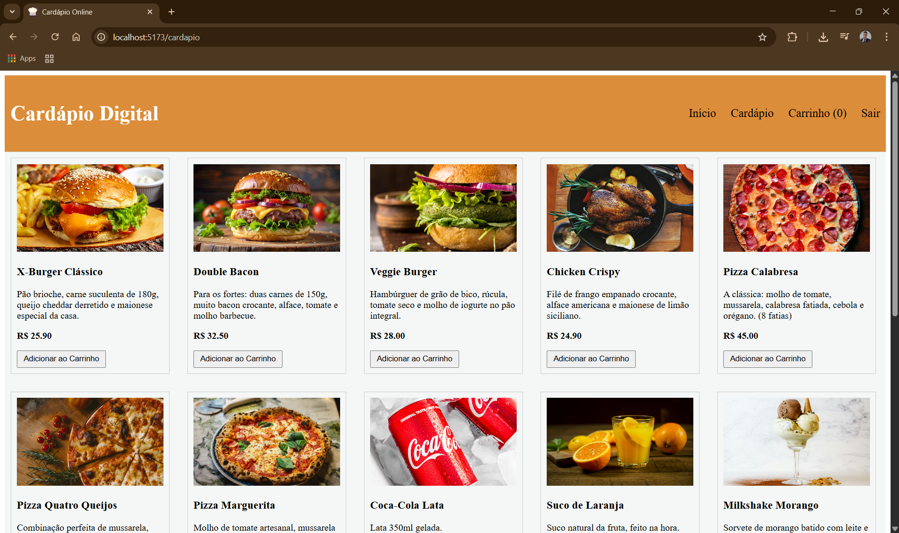
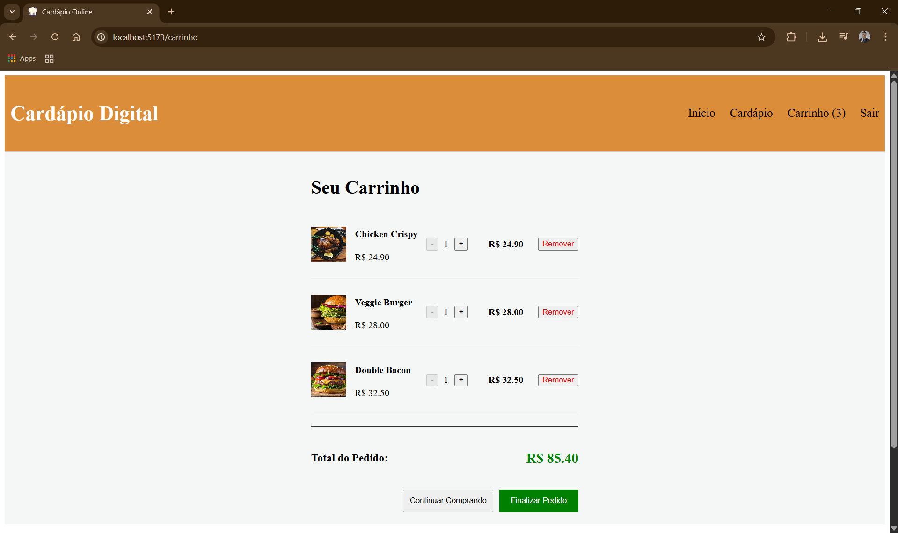

## 🍔 Cardápio Digital - Front-end com React & TypeScript

Este projeto é uma aplicação web de **Cardápio Digital** desenvolvida como Trabalho de Conclusão da disciplina de **Front-end e Frameworks** do curso de Análise e Desenvolvimento de Sistemas.

A aplicação simula a experiência de um autoatendimento, permitindo ao usuário navegar por produtos, gerenciar um carrinho de compras e simular a finalização de um pedido.

---

## 🚀 Tecnologias Utilizadas

O projeto foi desenvolvido utilizando as práticas mais modernas do ecossistema React:

* **React.js** (Biblioteca principal)
* **TypeScript** (Para tipagem estática e segurança do código)
* **Vite** (Build tool rápida e otimizada)
* **React Router Dom** (Gerenciamento de rotas e navegação SPA)
* **Context API** (Gerenciamento de Estado Global para o Carrinho)

---

## ✨ Funcionalidades

O sistema atende a todos os requisitos técnicos propostos, incluindo:

* ✅ **Autenticação:** Página de Login (Simulação).
* ✅ **Navegação SPA:** 5 páginas distintas (Login, Home, Cardápio, Carrinho, Checkout).
* ✅ **Componentização:** Arquitetura modular com componentes reutilizáveis (Botões, Cards, Navbar, etc.).
* ✅ **Estado Global:** Uso da Context API para gerenciar os itens do carrinho em toda a aplicação.
* ✅ **Hooks:** Uso de `useState`, `useEffect`, `useContext`, `useNavigate` e `useMemo`.
* ✅ **Checkout:** Resumo do pedido e seleção de forma de pagamento (Pix, Cartão, Dinheiro).

---

## 👥 Integrantes do Grupo

| Nome do Aluno | Componentes Desenvolvidos / Responsabilidades |
| :--- | :--- |
| **Samuel de Oliveira Passos Holanda - 01822563** | Navbar, Footer, Página Home |
| **Luis Henrique Moreira Oséas - 01805757** | Contexto do Carrinho, Página Carrinho, CartItem |
| **Gustavo Vinicius Carvalho Rocha Silva - 01811546** | MenuItemCard, Página Cardápio, Dados (MenuData) |
| **Josias Lima De Carvalho Neto - 01793618** | Login, Estilização Global |
| **Bruno Emanuel Olimpio Nunes - 01856466** | Checkout, PaymentMethod, Deploy |

---

## 📸 Screenshots

*(Adicione aqui prints das telas principais para valorizar o projeto)*

| Home | Cardápio | Carrinho |
| :---: | :---: | :---: |
|  |  |  |

---

## 🔧 Como Rodar o Projeto

Siga os passos abaixo para executar a aplicação em sua máquina local:

### Pré-requisitos
Certifique-se de ter o **Node.js** e o **Git** instalados.

### 1. Clone o repositório
Abra o terminal e digite:
```
git clone https://github.com/Samuelhollanda/cardapio_react_2.0.git
```
2. Entre na pasta do projeto
```
cd cardapio_react_2.0
```
3. Instale as dependências
```
npm install
```
4. Execute o projeto
```
npm run dev
```
O terminal mostrará um link (geralmente http://localhost:5173). Basta clicar nele para abrir no navegador.

## 📂 Estrutura de Pastas

O projeto segue uma estrutura organizada por responsabilidades:
```
/src
  ├── /assets         # Estilos globais e imagens
  ├── /components     # Componentes da aplicação
  │     ├── /features # Componentes específicos (Card, Carrinho, Login)
  │     └── /ui       # Componentes reutilizáveis (Navbar, Button, Footer)
  ├── /context        # Gerenciamento de estado (CartContext)
  ├── /data           # Dados estáticos (Mock do menu)
  ├── /pages          # Páginas da aplicação (Rotas)
  ├── /routes         # Configuração do React Router
  └── /types          # Interfaces TypeScript (Product, CartItem)
```

## 🔗 Links

Deploy (Aplicação Online): https://cardapio-react-2-0.vercel.app/

Repositório: https://github.com/Samuelhollanda/cardapio_react_2.0


---
